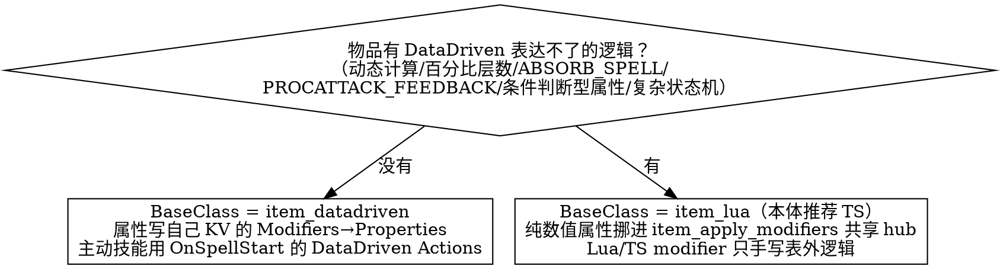

# 自定义物品（从零自制）

做一个**全新**物品（不是把某个原版物品数值翻倍）。先用下表确认这是不是该用的 skill：

| 场景 | skill |
| ---- | ---- |
| 继承原版物品差分、数值倍率克隆（`BaseClass` = 原版物品名） | `clone-item` |
| **从零自制**（`BaseClass` = `item_datadriven` / `item_lua`，含多材料合成神器） | **本 skill** |

> 图标、本地化、KV tab 缩进、`#base` 引入、参考文件路径 —— 全部见 CLAUDE.md「图片资源管理」「Dota 2 参考文件速查」与 `localization-format-guide`，本文不重复。

---

## 第一步：整体实现方式选型（先定这个，不是逐条属性决定）



决策只看「这个物品整体要不要 Lua」，不要纠结「这一条属性放哪」——属性层面的取舍只在「物品已经因为别的原因留着 Lua」的前提下才有意义。

**完整可迁移属性列表 / 必须 Lua 列表 / hub 用法（A 永久绑定物品 / B 永久不绑定 / C 临时 buff）** → 见 `references/datadriven-scope.md`，查表使用，不要凭记忆判断属性是否可 DataDriven。

### A. 纯 `item_datadriven`（无 Lua intrinsic modifier）

```kv
"item_my_new_item"
{
    "BaseClass"             "item_datadriven"
    "AbilityBehavior"       "DOTA_ABILITY_BEHAVIOR_PASSIVE"
    "AbilityTextureName"    "my_new_item"
    "AbilityValues" { "bonus_armor" "30" }
    "Modifiers"
    {
        "modifier_item_my_new_item"
        {
            "Passive"        "1"
            "IsHidden"        "1"
            "Attributes"     "MODIFIER_ATTRIBUTE_PERMANENT | MODIFIER_ATTRIBUTE_MULTIPLE | MODIFIER_ATTRIBUTE_IGNORE_INVULNERABLE"
            "Properties" { "MODIFIER_PROPERTY_PHYSICAL_ARMOR_BONUS" "%bonus_armor" }
        }
    }
}
```

主动技能优先用 `OnSpellStart` 的 DataDriven Actions（`FireSound`、`ApplyModifier`、`Damage` 等，完整列表见 [Valve Wiki Actions](https://developer.valvesoftware.com/wiki/Dota_2_Workshop_Tools/Scripting/Abilities_Data_Driven#Actions)）。仅当 Actions 也表达不了时，才用 `RunScript` 调一段**原生 Lua** 函数（`ScriptFile` 指向 `game/scripts/vscripts/items/<name>.lua`，引擎机制决定不经 TSTL，不是选择）。范例：`item_beast_armor`、`item_hawkeye_turret`。

### B. `item_lua`（本体推荐 TS）

实现放 `src/vscripts/items/ts_items/`，物品本体继承 `BaseItem`、intrinsic modifier 继承 `BaseItemModifier`（`src/vscripts/items/ts_items/base_item_modifier.ts`），范例见 `item_saint_orb.ts`：

```ts
import { BaseItem, registerAbility, registerModifier } from '../../utils/dota_ts_adapter';
import { BaseItemModifier } from './base_item_modifier';

@registerAbility('item_my_new_item')
export class ItemMyNewItem extends BaseItem {
  GetIntrinsicModifierName(): string {
    return 'modifier_item_my_new_item_passive';
  }
}

@registerModifier('items/ts_items/item_my_new_item', 'modifier_item_my_new_item_passive')
export class ModifierItemMyNewItemPassive extends BaseItemModifier {
  override statsModifierName = 'modifier_item_my_new_item_stats'; // 留空字符串 '' 表示不用 hub
  // 仅手写 references/datadriven-scope.md 列表之外的逻辑
}
```

KV `BaseClass` = `item_lua`，`ScriptFile` 指向 TSTL 编译产物路径。已有 51 个物品是历史遗留的**原生 Lua**（`game/scripts/vscripts/items/*.lua`，手写 `class({})` + `LinkLuaModifier`），不强制迁移，但新建一律走 TS。原生 Lua 写法仍可参考 `item_swift_glove.lua` 理解 hub 调用时机（`OnCreated` 必须先调 `OnRefresh`，`OnRefresh`/`OnDestroy` 都调 `RefreshItemDataDrivenModifier`）。

---

## 第二步：合成配方（Recipe）

```kv
"item_recipe_my_new_item"
{
    "BaseClass"          "item_datadriven"
    "Model"              "models/props_gameplay/recipe.vmdl"
    "AbilityTextureName" "item_recipe_my_new_item"
    "ItemCost"           "<图纸费用>"
    "ItemRecipe"         "1"
    "ItemResult"         "item_my_new_item"
    "ItemRequirements"
    {
        "01"             "item_a;item_b"   // 该槽位 a 或 b 任一满足
        "02"             "item_c"
    }
}
```

- 每个 `"0N"` 是一个**槽位**（AND 关系，全部槽位都要满足才能合成），槽位内用 `;` 分隔的是**该槽位的可选项**（OR 关系）。OR 列表里若混有 `item_fusion_agile` 这类无属性的纯令牌材料，习惯把它排在该槽位**最后一个**（参考 `item_recipe_ten_thousand_swords` 的写法），真正有数值的材料排在前面。
- **多路径合成**（同一神器允许从不同顺序的中间合成品拼出来，如 `item_recipe_sacred_trident` 用 4 个槽位覆盖 3 种两两合成顺序）属于高级用法，仅在用户明确要求"任意顺序都能合成"时才用，默认给单一路径即可。
- `ItemCost`（图纸费）/ 物品本体 `ItemCost`（合成后总价）：没有强制公式，按"材料总价 + 图纸费 = 物品总价"反推,具体数值找用户确认或参考同类神器定价。

### 配方材料变更时的属性取舍

多路径融合神器（`"01"` 槽位用 `;` 列出可选材料）的成品属性通常是**固定值**，与具体走哪条路径无关（先例：`item_fusion_agile` 是无属性的纯令牌材料，仅作为合成条件）。当配方新增/替换某个可选材料时，不要默认「维持固定属性不变」或「把新材料的全部数值/机制直接合并进成品」，而是按材料的投入成本分情况，用 `AskUserQuestion` 给出 2~3 档选项让用户取舍：

- 廉价/限购令牌材料（如 `item_fusion_agile`）：不贡献属性，维持现状即可
- 高价值神器材料（数千至数万金）：其独有数值（伤害/护甲/生命回复等）完全丢弃会显得浪费投入，可考虑追加一两条简单数值；但触发型机制（换血、连锁效果、主动单体增益等）通常不直接带入，否则成品会堆叠过多技能机制
- 每档明确标注舍弃了哪些机制，不要自行拍板

若某个可选材料的主动技能要求**继承**到成品上（而不是被丢弃），需要三处同步，缺一不可：
1. KV：成品的 `AbilityBehavior` 改为目标型行为，补齐 `AbilityUnitTarget*`、`AbilityCastRange` 等字段，以及该主动原有的充能/共享冷却机制
2. Lua/TS：把源材料的 `OnSpellStart` 逻辑搬到成品的实现里（充能消耗判定也要改成检查成品自己的物品名）
3. bot 会用：除 `bot-ability-usage` 的 AbilitySpec 注册外，检查 `ai/item/use-item.ts` 等按物品名硬编码调用的文件——这类文件不会因为复用了同一段技能逻辑就自动识别新物品，必须显式加一行调用，否则 bot 永远不会对新物品施放这个主动技能

### ID 分配

自制物品（非克隆）需要显式 `"ID"` 字段。取 `game/scripts/npc/npc_items_custom.txt` 中所有 `"ID"` 字段的当前最大值 + 1：

```
Grep pattern: "ID"
files: game/scripts/npc/npc_items_custom.txt
```

ID 一旦写入不要再改（项目内已有惯例注释："Do not change this once established"）。

---

## 第三步：收尾

- **图标 / 本地化 / `#base` 引入新 KV 文件** → 见 CLAUDE.md 与 `localization-format-guide`（物品同时有主动+被动时，两段 `<h1>` 之间用 `\n` 分隔，不要用 `<br><br>`，见该 skill 换行符规则一节）。
- **物品 KV 路径** → `game/scripts/npc/npc_items_custom.txt`（自制物品本体）；`game/scripts/npc/npc_items_modifier.txt`（`item_apply_modifiers` 共享 hub，仅放 `_stats`/独立永久 BUFF/临时 buff 的 DataDriven modifier，不放物品本体）。
- **bot 会用** → 参考 `bot-ability-usage` 的施法规则写法（物品同理登记到对应 AI 配置）。
- **验证** → 原生 Lua `script_reload` 实跑；TS 仅在收尾跑一次 `npm run build:vscripts` 看是否报错，不读编译产物；运行时行为靠 jest（自己的分支逻辑）+ Dota tools 实跑。

## 不明确时询问

用 `AskUserQuestion` 菜单确认，不要自行假设：
- 整体实现方式（`item_datadriven` 全 KV / `item_lua`+TS）当物品同时含属性和逻辑、语义不明时
- 某条属性是否「表外」必须留 Lua，存在歧义时（先查 `references/datadriven-scope.md`，仍不确定才问）
- 合成材料、配方费用、物品总价
- 是否需要多路径合成
