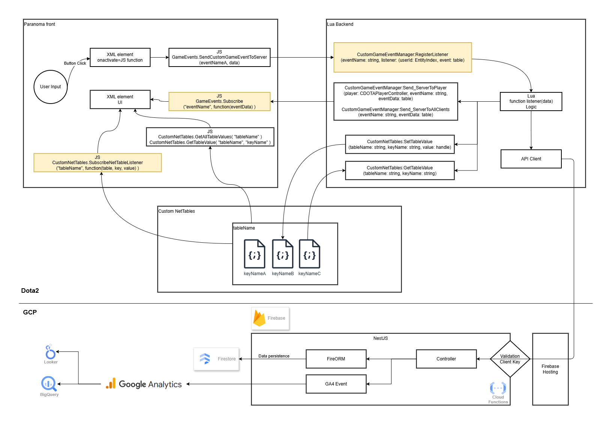

# Windy10v10AI

English | [简体中文](README_ZH.md)

This is a PVE Dota2 custom game project.<br>
Game is published on Steam workshop: [10v10 AI custom by windy](https://steamcommunity.com/sharedfiles/filedetails/?id=2307479570)

## 📊 Project Status

[](https://github.com/windy10v10ai/game/actions/workflows/test.yml)
[](https://github.com/windy10v10ai/game/releases)
[](LICENSE)
[](https://www.codefactor.io/repository/github/windy10v10ai/game)

[](https://github.com/windybirth/windy10v10ai/commits)
[](https://github.com/windybirth/windy10v10ai/graphs/commit-activity)
[](https://github.com/windy10v10ai/game/issues)
[](https://github.com/windy10v10ai/game/pulls)

[](https://github.com/windy10v10ai/game/graphs/contributors)
[](https://github.com/windy10v10ai/game/stargazers)
[](https://github.com/windy10v10ai/game/network)

## License

Licensed under the **GNU GPL v3** ([`LICENSE`](LICENSE)), with a Steam/Workshop
distribution exception and notes on prior MIT releases in
[`LICENSE.EXCEPTIONS.md`](LICENSE.EXCEPTIONS.md).

## Contributors

[](https://github.com/windy10v10ai/game)

### Join us

If you would like to contribute to Windy10v10AI, please see our [contributing guidelines](.github/CONTRIBUTING.md).

## Get Started

### OS Requirement

`Windows 10/11`

### Develop Tool

- [Github Desktop](https://desktop.github.com/)
- [VS Code](https://code.visualstudio.com/)
- [Source 2 Viewer](https://valveresourceformat.github.io/)

### Setup

1. Install Dota2 and [Dota 2 Workshop Tools](https://developer.valvesoftware.com/wiki/Dota_2_Workshop_Tools/Installing_and_Launching_Tools).
2. Install [node.js](https://nodejs.org/). The required version is pinned in [`.nvmrc`](.nvmrc) (`v24`).
   Recommend install node use [nvm](https://github.com/coreybutler/nvm-windows/releases)

   Run in PowerShell from the repository root. `nvm-windows` does not read `.nvmrc` directly,
   so pipe its content in via `$(Get-Content .nvmrc)`:

```powershell
# set/update node version
nvm install $(Get-Content .nvmrc)
nvm use $(Get-Content .nvmrc)
```

3. Clone this repository to local. **It must be on the same hard drive partition as Dota2.**
4. Run `npm install` in the repository root directory. Content and game folder will be linked to dota2 dota_addons directory.

```bash
npm install
```

### Claude Code (Optional)

This project ships with Claude Code configuration (`.claude/`) for AI-assisted development. Two ways to use it:

1. **Official subscription** — install [Claude Code](https://claude.com/claude-code) and sign in.
2. **Third-party API** — install the [Claude Code VS Code extension](https://marketplace.visualstudio.com/items?itemName=anthropic.claude-code), then set the endpoint and key in `.claude/settings.local.json` (git-ignored):

```json
{
  "env": {
    "ANTHROPIC_BASE_URL": "https://your-api-endpoint",
    "ANTHROPIC_AUTH_TOKEN": "your-api-key"
  }
}
```

Recommend installing the [GitHub CLI](https://cli.github.com/) and running `gh auth login`, so Claude Code can create pull requests and manage issues for you.

### Dota2 Reference Files (Optional)

Some development tasks (editing ability/item KV, localization, AI tuning) reference the vanilla Dota 2 files under `docs/reference/<version>/`. This directory is git-ignored, so you need to build it yourself with [Source 2 Viewer](https://valveresourceformat.github.io/): open `dota 2 beta/game/dota/pak01_dir.vpk` and extract the `scripts/npc/` folder together with the two localization files `abilities_english.txt` and `abilities_schinese.txt` into `docs/reference/<version>/`.

## Develop

### Launch Dota2 devTools and build the project

> Run in windows powershell/cmd

```bash
npm run start
```

### VConsole Command

> Run in Dota2 VConsole

```bash
# launch/relaunch custom game
dota_launch_custom_game windy10v10ai dota
dota_launch_custom_game windy10v10ai custom
# show game end panel
dota_custom_ui_debug_panel 7
# reload lua
script_reload
# Speeds the game up to that number
host_timescale <float>
```

### How to compile png to vtex_c

If a PNG is referenced within an XML file, it will be compiled automatically. For standalone PNG files, use the following method to compile.

1. Add png file to [`content/panorama/images`](content/panorama/images) folder.
2. Add image to [`content/panorama/layout/custom_game/images.xml`](content/panorama/layout/custom_game/images.xml) file.

png will be compiled to vtex_c automatically when you run `npm run start`.

## Troubleshooting

### Build or launch problems

This code needs to be on the same hard drive partition as dota2.
Reinstall solve most of the problems.

```bash
rm -r ./node_modules
npm install
```

### Ability effects disappear

If the console shows an error like the one below, the ability effects will disappear. Delete the file named in the error, then restart Dota2.

```
Failed loading resource "particles/units/heroes/hero_skywrath_mage/skywrath_mage_mystic_flare_ambient.vpcf_c" (ERROR_BADREQUEST: Code error - bad request)
```

## Project Structure

- **[src/common]:** TypeScript .d.ts type declaration files with types that can be shared between Panorama and VScripts
- **[src/vscripts]:** TypeScript code for Dota addon (Lua) vscripts. Compiles lua to game/scripts/vscripts.
  - **[src/vscripts/shared]:** Declarations shared by `panorama ts` and `tstl`, such as `custom_net_tables`
- **[src/panorama]:** TypeScript code for panorama UI. Compiles js to content/panorama/scripts/custom_game
- **[src/scripts]:** Node scripts for various helper tasks
- **[game/*]:** Dota game directory containing files such as npc kv files and compiled lua scripts. Synced with `dota 2 beta/game/dota_addons/your_addon_name`
- **[content/*]:** Dota content directory containing panorama sources other than scripts (xml, css, compiled js). Synced with `dota 2 beta/content/dota_addons/your_addon_name`

### Data Flow



## References

This project is based on the ModDota template and x-template.

- [ModDota TypeScriptAddonTemplate](https://github.com/ModDota/TypeScriptAddonTemplate) (sample modifiers and abilities: [src/vscripts](https://github.com/ModDota/TypeScriptAddonTemplate/tree/master/src/vscripts))
- [X-Template](https://github.com/XavierCHN/x-template)
- [TypeScript for VScripts](https://typescripttolua.github.io/) and [TypeScript Introduction](https://moddota.com/scripting/Typescript/typescript-introduction/)
- [TypeScript for Panorama](https://moddota.com/panorama/introduction-to-panorama-ui-with-typescript)
- [React in Panorama tutorial](https://moddota.com/panorama/react)

# Activity


[](https://star-history.com/#windybirth/windy10v10ai&Date)


